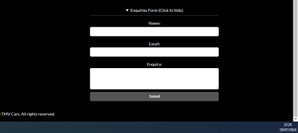

# TMV Cars

TMV Cars is an online platform for a car dealership located in Burton-on-Trent, United Kingdom. The site aims to provide a seamless browsing experience for customers looking to purchase used cars. The website is designed to cater to individuals interested in viewing the dealership's top car picks, browsing the available vehicles, and making inquiries. TMV Cars is tailored for a wide range of potential buyers, offering easy navigation, responsive design, and a straightforward way to contact the dealership.

## Responsive Mockup
The TMV Cars website is fully responsive, ensuring an optimal viewing experience across various devices, from desktops to mobile phones. The design adjusts seamlessly to different screen sizes, providing a consistent and user-friendly interface.

## Features

### Existing Features

1. **Navigation Bar**
   - Featured on all pages, the responsive navigation bar includes links to the Home, Top Picks, Browse Vehicles, Make an Enquiry, and Contact Us sections. It provides a consistent and easy navigation experience across the site.

   

2. **Landing Page**
   - The landing page features a prominent header with the dealership's name and a navigation bar. This section sets the tone for the rest of the site with its clean design and easy access to different sections. It also shows the Top picks that TMV cars offer showcasing the best cars for customers to see when they first acess the site, the remaing cars available are also partially visible.

   

3. **Top Picks Section**
   - This section showcases the dealership's highlighted vehicles, providing images and descriptions for each. It helps users quickly identify the most popular and recommended cars and allows the compnay to showcase their best cars first. 

4. **Browse Cars Section**
   - This section allows the customer to browse all the vehcile the dealership has available provdiing and summary of the key point regarding the car. this allows users to explore the range available and see what is suited to them. 

   

5. **Contact Information**
   - The footer includes detailed contact information, such as the dealership's address, email, and phone number. This section is crucial for users who want to reach out directly to TMV Cars or visit the dealership to see a vehicle.

   

6. **Enquiries Form**
   - Also located in the footer is an interactive form wich allows users to submit inquiries. It includes fields for name, email, and a message, making it easy for potential customers to get in touch. This section allows users to ask any questions they may have regaridng the vehile we have, services we provide or any other query they may have. The form also closes and expands to make better use of the space and provide a better experience.

    

7. **404 Error Page**
   - A custom 404 page informs users when they have navigated to a non-existent page, maintaining a consistent user experience even in error cases.

8. **Thank You Page**
   - After submitting an inquiry, users are directed to a thank-you page, acknowledging their submission and assuring them of a prompt response. they can then navigate away from this using the nav bar.

   

### Features Left to Implement

1. **Advanced Vehicle Search**
   - A future feature could include an advanced search option that allows users to filter cars by various criteria such as make, model, year, and price range.

2. **User Accounts**
   - Implementing user accounts could allow customers to save their favorite vehicles, receive notifications, and track inquiries.

3. **Sell my Vehicle**
  - A sell my vehcile page could allow users to enter their registration and enquire about selling their vehicle with TMV cars.

4. **Services**
 - A services section could outline the various services TMV cars offer, such as; home delivery, video viewing and selling your vehicle. 

## Testing

Extensive testing was conducted to ensure that all features work as intended. The site has been tested in chrome, on various devices, from desktop monitors to mobile phones. 

### Validator Testing
- **HTML**: some errors were detected when passing the HTML files through the W3C validator, upon examination these errors weren't relevant, the few that were have been amended.
- **CSS**: No issues were found using the Jigsaw CSS validator.
- **Acessibility**: I confirmed that the fonts, colours and code used are easy to read and acessible by testing it with Lighthouse.

## Deployment

The site was deployed using GitHub Pages. The steps to deploy are as follows:
1. Navigate to the Settings tab in the GitHub repository.
2. From the source section drop-down menu, select the master branch.
3. The page will automatically refresh with a ribbon display indicating the successful deployment.
4. The live link to the site is: [TMV Cars](https://8000-zee5p-project1reposito-tvxn5kmn3dg.ws.codeinstitute-ide.net/index.html#)

## Credits

### Content
- The descriptions of vehicles and dealership details were written specifically for this project. 
- All css and HTML code were written by myself using the content procvided by CodeInstitute

### Media
- The images used were taken by myself and the owner of TMV cars whom i know personally. All images were used with the permission of the owner.
